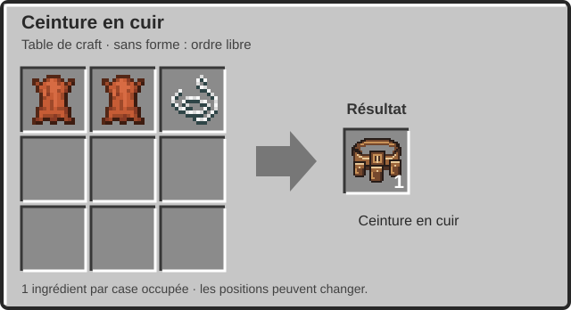
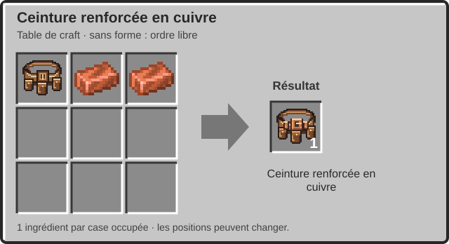
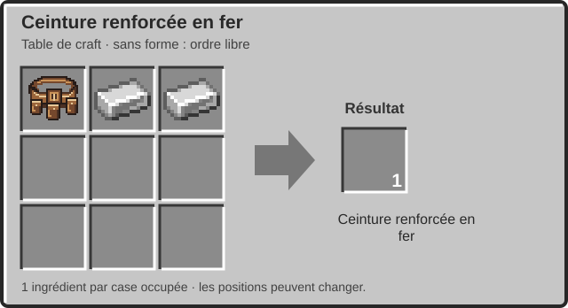
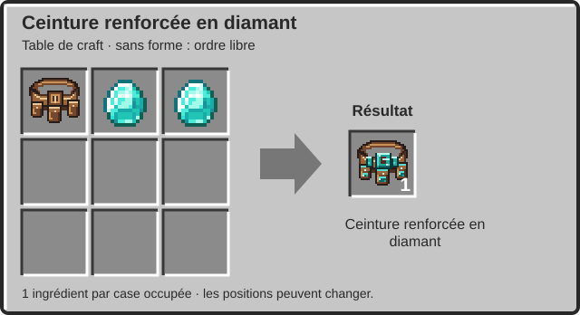
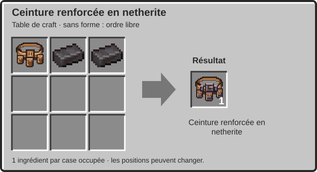
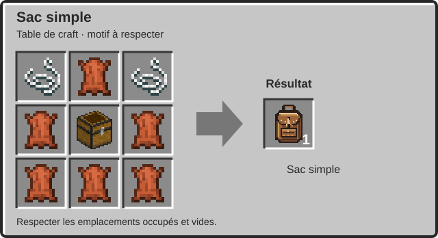
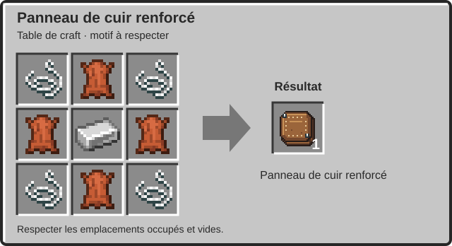
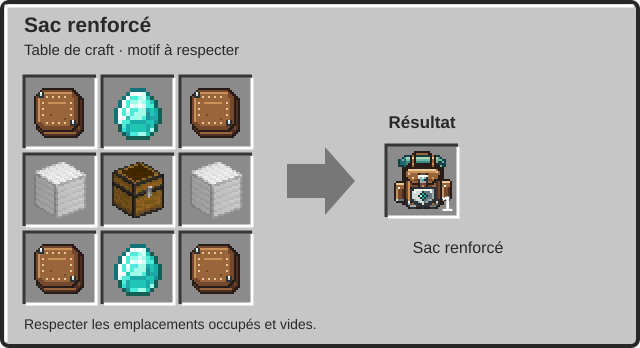

# Sacs à dos et ceintures — Guide du joueur

**Plus de place, trois raccourcis supplémentaires et une protection dans le dos, sans sacrifier son plastron ou ses élytres.** Ce guide explique comment fabriquer, porter, utiliser, améliorer et réparer les équipements du mod. Les **huit recettes** sont illustrées directement ci-dessous, avec les ingrédients dans la grille et l'objet obtenu à droite.

**Version documentée : Joranne Comfort 0.3.1**, fichier `joranne-comfort-0.3.1-mc1.21-all.jar`, pour **Minecraft Java 1.21 à 1.21.11 avec Fabric**. Les valeurs sont celles de la configuration par défaut ; un serveur ou un datapack peut les modifier.

> Documentation fondée sur les recettes, textures et mécanismes du JAR fourni par l'auteur. Les images sont des assemblages des véritables textures et des rendus hors jeu, pas des captures de Minecraft. Des règles indépendantes du jeu ont été exécutées et vérifiées ; le chargement du mod et les interactions complètes dans Minecraft n'ont pas été testés ici.

## Sommaire

[Premiers pas](#debut) · [Comparer les équipements](#comparaison) · [Crafts des ceintures](#ceintures) · [Crafts des sacs](#sacs) · [Équiper et ranger](#inventaire) · [Les trois raccourcis](#raccourcis) · [Protection dorsale](#protection) · [Enchantements](#enchantements) · [Usure et réparation](#reparation) · [Totems](#totems) · [Piles de 16](#empilement) · [Mort et sauvegarde](#sauvegarde) · [Configuration](#configuration) · [Installation](#installation) · [Questions pratiques](#questions) · [Sources](#sources)

## 1. Premiers pas

Commence par une **ceinture en cuir**, fabriquée avec deux cuirs et une ficelle. Ouvre ton inventaire et équipe-la dans l'emplacement de ceinture ajouté près de ton personnage. Elle fournit immédiatement **trois emplacements utilisables depuis la barre rapide**, en plus des neuf habituels.

Fabrique ensuite un **sac simple** avec six cuirs, deux ficelles et un coffre. Équipe-le dans l'emplacement de sac : **36 cases de rangement supplémentaires** deviennent accessibles depuis l'inventaire. Le sac et la ceinture se portent en même temps.

Pour davantage de stockage et de défense, prépare un **sac renforcé**. Il offre **72 cases**, ajoute **7 points d'armure** et bloque automatiquement une partie de certaines attaques arrivant de derrière. Les ceintures renforcées améliorent surtout la protection et la résistance à l'usure : elles ne donnent pas plus de trois cases.

**Les emplacements du sac et de la ceinture sont distincts des emplacements d'armure vanilla.** Tu peux garder un plastron ou des élytres tout en portant les deux équipements. Les laisser simplement dans ton inventaire ordinaire ne les équipe pas.

## 2. Choisir son équipement

| Équipement | Stockage supplémentaire | Armure ajoutée par défaut | Durabilité utile | Particularité |
|---|---:|---:|---:|---|
| Ceinture en cuir | 3 cases rapides | 1 point | 128 | La base des quatre renforcements. |
| Ceinture renforcée en cuivre | 3 cases rapides | 2 points | 256 | Renforcement accessible avec du cuivre. |
| Ceinture renforcée en fer | 3 cases rapides | 3 points | 384 | Plus résistante et protectrice que le cuivre. |
| Ceinture renforcée en diamant | 3 cases rapides | 4 points | 768 | Résistance nettement supérieure. |
| Ceinture renforcée en netherite | 3 cases rapides | 5 points | 1 024 | Plus haute durabilité des ceintures actuelles. |
| Sac simple | 36 cases, 4 rangées de 9 | Aucun | Pas d'usure gérée par ce système | Stockage sans protection dorsale. |
| Sac renforcé | 72 cases, 8 rangées de 9 | 7 points | 1 536 | Protection dorsale et enchantement dédié. |

Les points d'armure s'ajoutent à ceux de ton équipement habituel lorsque la pièce est **portée et fonctionnelle**. Ce ne sont ni des cœurs de vie supplémentaires ni un pourcentage fixe de dégâts bloqués : les règles d'armure de Minecraft interviennent ensuite. Une ceinture en netherite et un sac renforcé apportent ainsi **12 points d'attribut d'armure** à eux deux, avant les règles et limites du calcul de protection.

Une ceinture et un sac renforcé donnent **75 cases supplémentaires au total** : 72 dans le sac et 3 dans la ceinture. Les trois cases de la ceinture ne doivent pas être comptées une deuxième fois parce qu'elles apparaissent aussi dans la barre rapide.

### Et la ceinture en or ?

Une ancienne **ceinture en or** reste reconnue pour conserver les objets des sauvegardes antérieures. Elle possède trois cases, deux points d'armure et 192 points de durabilité utile par défaut ; son matériau de réparation est le lingot d'or. **Elle n'a pas de recette dans cette version et n'est pas proposée parmi les nouveaux équipements ajoutés au menu créatif.** Les recettes actuelles sont bien cuir, cuivre, fer, diamant et netherite.

## 3. Fabriquer et renforcer les ceintures

**Les cinq recettes de ceinture sont sans forme.** La disposition montrée est un exemple : l'ordre des ingrédients n'a pas d'importance, mais chaque ingrédient doit occuper sa propre case. Deux lingots empilés dans une seule case ne remplacent pas les deux ingrédients de la recette.

### Ceinture en cuir

**Ingrédients : 2 cuirs + 1 ficelle.**

**Résultat : 1 ceinture en cuir.** Une fois équipée, elle ajoute trois cases rapides et un point d'armure, tant qu'elle n'est pas abîmée. C'est cette ceinture, et non une ceinture déjà renforcée, qui sert de base aux quatre recettes suivantes.

### Ceinture renforcée en cuivre

**Ingrédients : 1 ceinture en cuir + 2 lingots de cuivre.**

**Résultat : 1 ceinture renforcée en cuivre.** Elle conserve trois cases rapides, mais donne deux points d'armure et une durabilité utile maximale de 256.

### Ceinture renforcée en fer

**Ingrédients : 1 ceinture en cuir + 2 lingots de fer.**

**Résultat : 1 ceinture renforcée en fer.** Elle donne trois points d'armure et possède une durabilité utile maximale de 384. Il n'est pas nécessaire de fabriquer la version cuivre avant celle-ci.

### Ceinture renforcée en diamant

**Ingrédients : 1 ceinture en cuir + 2 diamants.**

**Résultat : 1 ceinture renforcée en diamant.** Elle fournit quatre points d'armure et possède une durabilité utile maximale de 768. Une ceinture en fer ne remplace pas la ceinture en cuir demandée.

### Ceinture renforcée en netherite

**Ingrédients : 1 ceinture en cuir + 2 lingots de netherite.**

**Résultat : 1 ceinture renforcée en netherite.** Elle fournit cinq points d'armure et possède une durabilité utile maximale de 1 024.

**Cette fabrication se fait dans une grille de craft, pas à la table de forge.** Elle ne demande ni modèle d'amélioration ni ceinture en diamant. Les quatre renforcements partent directement de la ceinture en cuir ; ce n'est pas une chaîne cuir → cuivre → fer → diamant → netherite.

### Que deviennent les objets déjà rangés dans la ceinture ?

Le renforcement transfère les données de la ceinture en cuir vers le résultat, notamment **son contenu et les composants personnalisés, comme le nom ou les enchantements présents**. Retire d'abord la ceinture de son emplacement équipé pour la mettre dans la grille.

**Renforcer n'est pas réparer.** Le niveau d'usure est conservé proportionnellement à la nouvelle durabilité, avec un arrondi vers le haut. Par exemple, une ceinture en cuir usée à moitié reste usée à moitié une fois renforcée en diamant. Une ceinture déjà totalement abîmée ne retrouve pas ses fonctions simplement en changeant de matériau : il faut la réparer.

Cette conservation concerne les recettes prévues pour renforcer **une ceinture en cuir**. Elle ne crée pas une recette permettant de convertir n'importe quelle ceinture en une autre.

## 4. Fabriquer les sacs et leur matériau renforcé

Les trois recettes suivantes ont un **motif précis à respecter**. Le résultat de chacune est **un seul objet**.

### Sac simple

**Ingrédients : 6 cuirs + 2 ficelles + 1 coffre.**

Place les ficelles dans les deux coins du haut, le coffre au centre et le cuir dans les six autres cases.

**Résultat : 1 sac simple de 36 cases.** Équipe-le dans l'emplacement de sac pour afficher son rangement. Il ne donne pas de points d'armure et ne bloque pas les attaques dans le dos. Le mécanisme de durabilité des équipements renforcés ne lui est pas appliqué.

### Panneau de cuir renforcé

**Ingrédients : 4 cuirs + 4 ficelles + 1 lingot de fer.**

Les ficelles occupent les quatre coins. Le cuir se place en haut, en bas, à gauche et à droite du lingot central.

**Résultat : 1 panneau de cuir renforcé**, pas quatre. C'est un matériau : il ne se porte pas et n'ajoute pas de cases à lui seul. Il sert à fabriquer le sac renforcé et à réparer ce sac à l'enclume.

### Sac renforcé

**Ingrédients : 4 panneaux de cuir renforcé + 2 diamants + 2 blocs de fer + 1 coffre.**

Place les panneaux aux quatre coins, les diamants en haut et en bas au centre, les **blocs de fer** de chaque côté du coffre central. **Deux lingots ne remplacent pas les deux blocs de fer.**

**Résultat : 1 sac renforcé de 72 cases.** Une fois porté et fonctionnel, il ajoute sept points d'armure et active la protection dorsale décrite plus loin. Sa durabilité utile maximale est de 1 536.

Pour partir des matériaux de base, hors fabrication du coffre, prévois **16 cuirs, 16 ficelles, 2 diamants, 1 coffre et l'équivalent de 22 lingots de fer** : quatre lingots dans les quatre panneaux et dix-huit lingots pour les deux blocs.

**Le sac simple n'est pas un ingrédient de cette recette.** Tu fabriques un autre sac, puis tu peux remplacer celui que tu portes. Les objets ne sont pas transférés automatiquement du sac simple au nouveau sac renforcé : chaque sac conserve son propre contenu. Déplace les objets manuellement, au besoin en utilisant un coffre intermédiaire.

## 5. Équiper, ouvrir et organiser son rangement

### Les deux emplacements supplémentaires

Ouvre l'inventaire de ton personnage. Les emplacements dédiés au sac et à la ceinture apparaissent près de sa représentation : **le sac au-dessus, la ceinture en dessous**. Dépose le bon objet dans le bon emplacement. Depuis l'inventaire du joueur, le transfert rapide par **Maj + clic** peut équiper l'objet lorsque son emplacement est libre.

Tu peux porter **un sac et une ceinture** à la fois. Une ceinture dans l'emplacement de sac, ou un sac dans l'emplacement de ceinture, n'est pas accepté. Ces deux pièces n'occupent pas l'emplacement du plastron ; leurs rendus portés sont également prévus pour être synchronisés avec les autres joueurs.

### Accéder aux cases

Le rangement du sac se présente dans un **panneau à droite de l'inventaire du joueur**. Le sac simple affiche quatre rangées de neuf cases ; le renforcé en affiche huit. Il n'est pas nécessaire de poser le sac au sol comme un coffre ou de chercher une recette pour l'ouvrir.

Dépose et retire les objets comme dans un inventaire. Le transfert rapide depuis l'inventaire ordinaire peut envoyer les objets admissibles vers le sac lorsqu'il est équipé, fonctionnel et dispose de place. Lorsqu'un objet ne passe pas, vérifie aussi les restrictions de rangement ci-dessous, pas seulement le nombre de cases libres.

La ceinture offre trois emplacements distincts. Les objets qui y sont rangés sont ceux des trois raccourcis supplémentaires : il ne s'agit pas d'une copie des objets de l'inventaire.

### Retirer ou changer son équipement

**Le contenu appartient à l'objet sac ou ceinture.** Retirer un équipement de son emplacement ne vide pas ses cases par terre et ne transforme pas son contenu en objets séparés. Remets-le dans son emplacement pour accéder de nouveau à son rangement.

Un sac transporté dans l'inventaire ordinaire garde son contenu, mais ne fournit pas alors ses cases utilisables ni ses bonus de port. Pour changer d'équipement, retire l'ancien, libère l'emplacement puis équipe le nouveau.

### Ce qui ne peut pas être rangé à l'intérieur

Le mod empêche les emboîtements de conteneurs dans les sacs **et** dans les ceintures. Il refuse notamment :

- les sacs et les ceintures de ce mod, même vides ;
- les boîtes de Shulker, y compris les variantes colorées et les boîtes vides ;
- les bundles, y compris leurs variantes colorées et même lorsqu'ils sont vides ;
- les objets portant un composant d'inventaire de conteneur reconnu par le système.

Les matériaux, outils et autres objets ordinaires restent admissibles s'ils ne correspondent pas à ces exclusions. Un **coffre ordinaire sous forme d'objet**, sans inventaire embarqué, n'est pas la même chose qu'une boîte de Shulker contenant des objets.

## 6. Utiliser les trois cases rapides de la ceinture

Avec une ceinture fonctionnelle équipée, la barre rapide passe de **9 à 12 emplacements**. La molette peut parcourir l'ensemble, et les trois dernières cases disposent de touches dédiées.

| Case supplémentaire | Clavier français AZERTY par défaut | Clavier QWERTY par défaut |
|---|---|---|
| 10 | `à` | `0` |
| 11 | `)` | `-` |
| 12 | `=` | `=` |

Ce sont les touches de la **rangée supérieure**, pas celles du pavé numérique. Les neuf premières cases conservent les raccourcis habituels de Minecraft. Les noms affichés dépendent de la disposition du clavier ; la configuration enregistre les codes des touches.

Place, par exemple, une pioche ou une autre ressource utile dans la ceinture, sélectionne la case correspondante, puis utilise l'objet avec les commandes habituelles. Le mod fait correspondre l'objet sélectionné à la main du joueur ; ce ne sont pas seulement trois emplacements de stockage décoratifs.

Les raccourcis sont destinés au jeu normal, **sans écran d'inventaire ou autre interface ouvert**. Si tu retires la ceinture ou qu'elle devient totalement abîmée, ses trois cases cessent d'être sélectionnables et la sélection revient dans les neuf cases ordinaires. Le contenu reste récupérable depuis l'inventaire.

Les touches peuvent être changées dans le [fichier de configuration](#configuration). Il n'est pas nécessaire d'attribuer une touche d'ouverture séparée au sac : son rangement se consulte dans l'inventaire du joueur.

## 7. La protection dorsale du sac renforcé

**Seul le sac renforcé possède cette fonction.** Il doit être équipé, disposer de durabilité utile et avoir sa protection dorsale activée dans les réglages du serveur.

La protection est **automatique** : tu ne maintiens pas une touche pour lever le sac comme un bouclier. Le mod vérifie d'où arrive l'attaque. Une attaque admissible venant de derrière peut être partiellement bloquée ; une attaque de face ne bénéficie pas de cette parade. Une attaque exactement sur le côté n'est pas assimilée à une attaque de dos.

### Quelle quantité de dégâts est bloquée ?

| Renforcement dorsal sur le sac | Part des dégâts arrière admissibles bloquée |
|---|---:|
| Sans cet enchantement | 40 % |
| Niveau I | 50 % |
| Niveau II | 60 % |
| Niveau III | 70 % |
| Niveau IV | 80 % |

Ces pourcentages décrivent la **parade dorsale**, distincte des sept points d'armure du sac et des autres protections. À titre d'exemple, une attaque arrière admissible de dix points laisse passer six points sans l'enchantement, ou deux points avec le niveau IV, **avant les autres calculs de protection applicables**. Cela ne signifie pas que tous les dommages du jeu sont réduits de 40 à 80 %.

### Quelles attaques sont concernées ?

Le mécanisme vise les attaques physiques admissibles : des coups de mêlée et certains projectiles arrivant par l'arrière. Pour un projectile, la direction de son déplacement peut servir à déterminer son arrivée, pas uniquement la position actuelle du tireur.

La parade ne couvre pas les dégâts exclus par les règles du mod, notamment **le feu, les explosions, les chutes, la noyade, le gel et les attaques qui contournent l'armure, les boucliers ou l'invulnérabilité**. Les projectiles perforants portant un niveau de perforation sont également exclus. Un danger environnemental sans attaque arrière admissible ne devient pas bloquable simplement parce que tu portes un sac.

### Attention aux haches

Après une parade de mêlée concernée contre une **hache vanilla**, la garde dorsale est suspendue pendant **100 ticks**, soit environ **5 secondes à 20 ticks par seconde**. L'enchantement ne supprime pas cette suspension.

C'est la parade qui est interrompue, pas nécessairement tous les points d'armure du joueur. Le sac doit néanmoins rester fonctionnel pour continuer à apporter ses propres bonus. Bloquer des dégâts use le sac : la défense n'est pas une protection gratuite et permanente.

## 8. Enchanter son équipement

### Renforcement dorsal : l'enchantement propre au sac renforcé

**Renforcement dorsal possède quatre niveaux, de I à IV.** Chaque niveau ajoute dix points de pourcentage au blocage arrière de base, jusqu'à 80 %. Il est réservé au **sac renforcé** : une ceinture ou le sac simple ne deviennent pas des boucliers dorsaux en recevant ce livre.

L'enchantement est inclus dans les catégories permettant son obtention par enchantement normal et dans les échanges de livres. Cherche-le à la **table d'enchantement** ou parmi les offres de **bibliothécaires** ; cela ne garantit pas que chaque proposition ou chaque marchand le donne. Un livre compatible peut ensuite être appliqué au sac renforcé à l'enclume, avec le coût affiché par le jeu.

### Solidité, Raccommodage et protections

Le système d'équipements durables prévoit les familles d'enchantements correspondant à **Solidité**, **Raccommodage** et aux **protections compatibles avec un équipement de torse**. Il ne faut pas en déduire que tous les enchantements d'armure, de bottes ou d'armes sont autorisés.

**Solidité** peut limiter la consommation de durabilité selon les règles appliquées aux dommages d'équipement. **Raccommodage** utilise l'expérience ramassée pour réparer les pièces équipées qui en bénéficient. Les protections admissibles participent au calcul de réduction des dégâts tant que la pièce reste fonctionnelle.

Le **sac simple n'appartient pas au catalogue d'équipements durables enchantables de ce système**. Les usages ci-dessus concernent les ceintures concernées et le sac renforcé, pas une promesse d'ajouter arbitrairement ces enchantements à tout objet du mod.

Une enclume peut afficher un refus pour un enchantement incompatible ou une combinaison interdite. Consulte la sortie proposée avant de valider : un livre enchanté n'est pas un ingrédient de craft de ceinture ou de sac.

## 9. Durabilité, équipement abîmé et réparation

### Comment l'équipement s'use-t-il ?

Les ceintures durables et le sac renforcé s'usent notamment lorsqu'ils participent à la réception des coups ; le sac reçoit aussi de l'usure lorsqu'il bloque des dégâts dans le dos. **Ouvrir son rangement ou marcher n'est pas la dépense d'usure décrite par ce mécanisme.** Les joueurs en créatif et les situations exemptées par les règles ne subissent pas cette usure normale.

La partie liée aux coups positifs utilise une base d'au moins un point d'usure, calculée à partir des dégâts entrants. La parade dorsale peut ajouter une dépense proportionnelle aux dégâts bloqués, arrondie au point supérieur. Solidité et les autres conditions d'équipement interviennent ensuite : un nombre de coups n'est donc pas une durée de vie fixe.

Survole l'objet pour lire sa **durabilité utile restante**. Le tableau de ce guide donne la réserve réellement utilisable. Le mod garde une marge interne pour empêcher la destruction normale de l'objet au seuil d'épuisement : c'est pourquoi un outil technique affichant la durabilité vanilla peut voir une valeur maximale supérieure d'un point.

### Que se passe-t-il à zéro ?

L'équipement devient **abîmé**, mais **son contenu est conservé**. Son inventaire passe en **retrait uniquement** : tu peux récupérer les objets, mais pas continuer à en déposer comme dans un équipement en bon état.

Il ne donne plus ses avantages fonctionnels : bonus d'armure, protection dorsale du sac et sélection rapide des trois cases de la ceinture sont désactivés selon la pièce concernée. Ce n'est pas un sac qui explose ou une ceinture qui efface ses outils lorsqu'elle atteint sa limite.

Répare l'objet pour rétablir ses fonctions. Tant qu'une ceinture est abîmée, déplace les outils ou totems nécessaires vers ton inventaire ordinaire plutôt que de compter sur ses raccourcis.

### Réparer avec des matériaux à l'enclume

Place l'équipement à réparer dans la **case de gauche** de l'enclume, puis son matériau de réparation à droite. Vérifie la sortie et le coût d'expérience affiché avant de prendre le résultat.

| Équipement à réparer | Matériau à placer à droite |
|---|---|
| Ceinture en cuir | Cuir |
| Ceinture renforcée en cuivre | Lingot de cuivre |
| Ceinture renforcée en fer | Lingot de fer |
| Ancienne ceinture en or | Lingot d'or |
| Ceinture renforcée en diamant | Diamant |
| Ceinture renforcée en netherite | Lingot de netherite |
| Sac renforcé | Panneau de cuir renforcé |

**Le matériau de fabrication ne correspond pas toujours au matériau de réparation complet.** Le sac renforcé se répare avec un panneau, pas avec sa recette entière, un coffre ou un bloc de fer. Le sac simple n'a pas de réparation d'usure prévue dans ce catalogue puisqu'il n'y subit pas cette usure.

Une réparation d'un équipement unique avec le bon matériau est prévue pour conserver son contenu. Le coût total dépend de l'opération et de l'historique de l'objet ; ce guide ne fixe pas un coût universel en niveaux.

### Pourquoi une fusion de deux sacs ou ceintures peut-elle être refusée ?

Une réparation qui combine **deux équipements de stockage** est refusée si **l'un des deux contient encore des objets**. Cette sécurité concerne les voies de combinaison prises en charge, notamment l'enclume, les recettes de réparation et la meule.

**Vide les deux équipements avant de les combiner.** Deux conteneurs pleins ne sont pas automatiquement fusionnés pour réunir leurs contenus. Cela n'interdit pas pour autant de réparer un équipement rempli avec son matériau : ce sont deux opérations différentes.

### Réparer avec Raccommodage

Équipe la pièce enchantée avec **Raccommodage**, puis ramasse de l'expérience. Le mod dirige une partie de la réparation vers les équipements portés concernés, en répartissant la priorité entre ceinture et sac. Une pièce abîmée peut ainsi être réparée : elle n'a pas besoin de redevenir fonctionnelle avant que Raccommodage puisse agir.

Un équipement simplement laissé dans le rangement du sac n'est pas considéré comme l'équipement porté à réparer. Et améliorer une ceinture en cuir en une ceinture renforcée ne remplace pas cette réparation, puisque son usure relative est conservée.

## 10. Les totems utilisables depuis l'inventaire

Par défaut, le mod permet de déclencher un **totem d'immortalité sans le tenir en main**, à condition qu'un totem admissible soit réellement présent dans une zone recherchée et que les conditions normales de déclenchement soient réunies.

Les totems tenus dans les mains restent prioritaires. Si aucun n'est disponible dans les deux mains, la recherche supplémentaire consulte les **trois cases d'une ceinture fonctionnelle**, puis les **36 cases de l'inventaire ordinaire**, barre rapide vanilla comprise.

**Les cases du sac à dos ne sont pas parcourues.** Un totem rangé au fond du sac simple ou renforcé ne bénéficie donc pas de cette recherche automatique. Les contenus des boîtes de Shulker, bundles ou autres inventaires transportés ne sont pas davantage inspectés.

| Emplacement du totem | Recherche supplémentaire du mod |
|---|---|
| En main principale ou secondaire | La priorité normale du jeu est conservée. |
| Dans une ceinture équipée et fonctionnelle | Oui. |
| Dans l'inventaire ordinaire, y compris les neuf cases rapides | Oui, même sans ceinture. |
| Dans une ceinture totalement abîmée | Non pour ces trois cases. |
| Dans le contenu d'un sac simple ou renforcé | Non. |

Le totem est consommé lorsqu'il est utilisé. Ce réglage ne crée pas un totem gratuit et ne promet pas de contourner toutes les exclusions normales des dégâts mortels. L'administrateur peut désactiver cette fonction avec `inventory_totems=false`.

## 11. Les objets qui peuvent s'empiler par 16

Le mod relève par défaut à **16** la taille maximale de certaines piles d'objets vanilla habituellement non empilables. Cette amélioration n'est pas une capacité réservée aux sacs : elle concerne les piles admissibles dans les inventaires.

| Famille | Objets concernés | Ce qui n'est pas inclus dans cette famille |
|---|---|---|
| Lits | Les différentes couleurs de lits vanilla | Pas une règle générale pour les lits ajoutés par d'autres mods. |
| Bateaux | Bateaux ordinaires et radeau de bambou | Bateaux et radeaux avec coffre. |
| Wagonnets | Wagonnet ordinaire | Wagonnets à coffre, à entonnoir et autres variantes spécialisées. |
| Totems | Totems d'immortalité | Pas tous les objets de protection. |
| Potions | Potions buvables, jetables et persistantes | Les potions différentes ne deviennent pas identiques pour autant. |

Pour fusionner deux piles, les objets doivent rester compatibles entre eux : **même objet et mêmes données pertinentes**. Une potion de soin et une potion de vitesse ne se mélangent pas arbitrairement dans une seule pile. La taille relevée n'est ni 64 ni illimitée.

Cette règle ne transforme pas les armes ou outils durables en objets empilables. Elle n'étend pas automatiquement tous les objets de tous les mods. Chaque famille peut être activée ou désactivée séparément dans la configuration.

## 12. Mort, sauvegarde et multijoueur

### Conserver son contenu

Le mod enregistre les équipements portés et les objets contenus dans leurs inventaires. Retirer un sac, se déconnecter ou sauvegarder est prévu pour conserver ces données. Le rangement est associé à la pièce, pas à un emplacement qui se remplirait à nouveau gratuitement lorsque tu changes de sac.

Lors d'un changement de sac, ne confonds donc pas un sac vide fraîchement fabriqué avec ton ancien sac rempli : ce sont deux objets distincts.

### En cas de mort

Lorsque la mort entraîne la perte normale de l'inventaire, les équipements sont prévus pour être déposés avec **leur contenu conservé dans l'objet**. Récupère puis rééquipe ton sac ou ta ceinture pour retrouver ce contenu. Lorsque la règle `keepInventory` conserve l'inventaire, la gestion des équipements suit cette conservation.

**Contenu conservé ne veut pas dire objet au sol indestructible.** Cela n'offre pas une garantie contre la disparition normale des objets, le vide, la lave ou les interventions d'autres mods. Sauvegarder un monde important reste nécessaire ; ces parcours de mort et de rechargement n'ont pas été testés en jeu dans le cadre de ce guide.

### Sur un serveur

Installe le mod et ses dépendances **sur le serveur et sur les clients des joueurs**. Ce n'est pas uniquement un changement visuel local : le serveur gère les équipements, leurs contenus et les règles de jeu. La connexion échange les paramètres de gameplay nécessaires ; les valeurs locales d'un client ne doivent pas être considérées comme un moyen de contourner les réglages du serveur.

Les raccourcis de clavier restent propres au joueur. Le rendu des sacs et ceintures portés est prévu pour être communiqué aux autres clients équipés du mod.

Avant de retirer le mod d'une partie, sauvegarde le monde, vide les équipements dans des rangements vanilla et retire les pièces portées. Ne compte pas sur une désinstallation pour convertir automatiquement leur contenu en objets récupérables.

## 13. Configuration

Les réglages se trouvent dans **`config/joranne-comfort.properties`**, créé par le mod. Arrête la partie ou le serveur avant de modifier le fichier, puis redémarre pour appliquer les changements. Sur un serveur, modifie les paramètres de gameplay du serveur ; les touches concernent le client du joueur.

### Les principales options

| Paramètre | Valeur par défaut | Effet |
|---|---|---|
| `inventory_totems` | `true` | Active la recherche de totems dans la ceinture fonctionnelle et l'inventaire ordinaire. |
| `backpack_rear_shield` | `true` | Active la garde dorsale du sac renforcé. |
| `stack_beds` | `true` | Autorise les piles de 16 lits admissibles. |
| `stack_boats` | `true` | Autorise les piles de 16 bateaux ordinaires et radeaux admissibles. |
| `stack_minecarts` | `true` | Autorise les piles de 16 wagonnets ordinaires. |
| `stack_totems` | `true` | Autorise les piles de 16 totems. |
| `stack_potions` | `true` | Autorise les piles de 16 potions compatibles. |
| `armor_leather` | `1` | Points d'armure de la ceinture en cuir. |
| `armor_copper` | `2` | Points d'armure de la ceinture en cuivre. |
| `armor_iron` | `3` | Points d'armure de la ceinture en fer. |
| `armor_gold` | `2` | Valeur de compatibilité de l'ancienne ceinture en or. |
| `armor_diamond` | `4` | Points d'armure de la ceinture en diamant. |
| `armor_netherite` | `5` | Points d'armure de la ceinture en netherite. |
| `armor_reinforced_backpack` | `7` | Points d'armure du sac renforcé. |

Le code borne les valeurs d'armure des ceintures entre **0 et 10**, et celle du sac renforcé entre **7 et 20**. Saisir une valeur hors plage ne signifie pas que le mod l'appliquera telle quelle.

### Les touches de ceinture

| Paramètre | Code par défaut | Touche physique correspondante |
|---|---:|---|
| `belt_slot_10_glfw_key` | `48` | `à` sur AZERTY, `0` sur QWERTY. |
| `belt_slot_11_glfw_key` | `45` | `)` sur AZERTY, `-` sur QWERTY. |
| `belt_slot_12_glfw_key` | `61` | `=` sur les dispositions indiquées. |

Ces valeurs sont des **codes GLFW**, pas les numéros de cases de l'inventaire. Choisis des codes de touches valides et évite de réutiliser une touche déjà indispensable à une autre action. Le fichier comporte aussi `belt_keybind_schema`, un numéro de migration interne : ce n'est pas un réglage de capacité ou de protection à modifier pour jouer.

Les anciennes valeurs par défaut du pavé numérique peuvent être migrées vers les touches de la rangée supérieure ; le mécanisme prévoit une sauvegarde du fichier avant cette migration. Les valeurs réellement présentes dans ton fichier priment sur les raccourcis par défaut indiqués ici.

**La capacité de 36 ou 72 cases, la durabilité des pièces et les pourcentages de garde ne disposent pas de paramètres libres dans ce fichier tel qu'il est fourni.** Ne les modifie pas en inventant une nouvelle clé en espérant qu'elle sera lue.

## 14. Installation et versions

Le JAR fourni déclare les conditions suivantes : **Minecraft Java de 1.21 à 1.21.11 inclus**, **Fabric Loader 0.18.4 ou supérieur**, **Java 21 ou supérieur** et **Fabric API**.

Installe le profil Fabric correspondant à ta version de Minecraft, ajoute une version de Fabric API adaptée à ce profil, puis place `joranne-comfort-0.3.1-mc1.21-all.jar` dans le dossier `mods`. Pour le multijoueur, prépare aussi l'installation côté serveur. Ne laisse pas plusieurs versions de Joranne Comfort chargées ensemble.

Le nom affiché dans les informations du mod est **Joranne Comfort** et son identifiant est `joranne_comfort`. Le nom de ce dépôt, **Sacs à dos et ceintures**, décrit son contenu.

### Pourquoi le même JAR contient-il deux formats de recettes ?

Le mod choisit automatiquement le format adapté : le premier pour **1.21 et 1.21.1**, le second pour **1.21.2 à 1.21.11**. Les recettes fournies dans ces deux ensembles ont été comparées : **mêmes ingrédients, mêmes motifs et mêmes résultats**. Il s'agit donc de **huit recettes jouables**, pas de seize fabrications différentes.

Tu n'as pas à installer séparément ces packs internes de compatibilité. Leur sélection ne constitue cependant pas, à elle seule, une preuve que toute combinaison de mods ou chaque interface a été validée en jeu sur les douze cibles.

Ce fichier ne déclare pas la compatibilité Forge, NeoForge, Bedrock ou Minecraft 26. Aucune compatibilité supplémentaire n'est déduite du seul mot « all » dans son nom.

## 15. Questions pratiques

### Ma ceinture en diamant n'a que trois cases : est-ce normal ?

Oui. **Toutes les ceintures ont trois cases.** Le matériau change la protection, la résistance à l'usure et les matériaux de réparation, pas leur capacité.

### Je porte des élytres : dois-je retirer le sac ?

Non, le sac utilise son emplacement propre. Il est prévu pour être porté avec un plastron ou des élytres. Ce guide ne garantit pas le rendu avec tous les mods qui remplacent entièrement l'inventaire ou le modèle du joueur.

### Le craft de la ceinture en netherite ne fonctionne pas avec une ceinture en diamant.

La base demandée est une **ceinture en cuir**, avec **deux lingots de netherite dans deux cases**. Utilise une grille de craft, pas une table de forge.

### Mon sac renforcé ne se fabrique pas.

Vérifie les **quatre panneaux de cuir renforcé**, les **deux blocs de fer**, les **deux diamants**, le coffre central et leur disposition. Du cuir ordinaire ne remplace pas les panneaux ; des lingots ne remplacent pas les blocs. Chaque fabrication de panneau n'en produit qu'un.

### Je ne peux pas mettre une boîte de Shulker vide dans le sac.

C'est une restriction prévue. Le refus concerne le type de conteneur, pas seulement le fait qu'il soit rempli. La ceinture suit aussi ces restrictions.

### Mon équipement garde mes objets, mais je ne peux plus en ajouter.

Survole-le et vérifie sa durabilité utile. Une pièce totalement abîmée passe en **retrait uniquement**. Répare-la avec son matériau ou grâce à Raccommodage pour retrouver ses fonctions.

### Le totem dans mon sac n'a pas été utilisé automatiquement.

Le système ne cherche **pas dans les sacs à dos**. Garde le totem dans l'inventaire ordinaire, dans une ceinture fonctionnelle ou dans une main, et vérifie que `inventory_totems` est activé sur le serveur.

### Mon sac renforcé ne bloque pas tous les coups.

Il ne bloque qu'une partie des **attaques arrière admissibles**. Vérifie la direction, la durabilité, l'activation du réglage et l'absence de suspension après une hache. Le feu, les explosions et les attaques exclues ne sont pas couverts par la garde dorsale.

### L'enclume refuse de réunir deux équipements.

Vérifie d'abord que **les deux sont vides**. La protection contre la fusion de conteneurs remplis est distincte de la réparation d'un équipement unique avec son matériau.

## 16. Sources et portée de la vérification

Ce guide documente **le JAR fourni**, et non une liste de fonctionnalités souhaitées. Les textes ont été établis à partir des recettes et de la lecture du code compilé : capacités, port des équipements, sélection rapide, conservation du contenu, garde dorsale, enchantements, usure, réparation, totems et règles d'empilement.

Les **huit recettes** ont été rapprochées entre les deux formats de compatibilité, et les images reprennent leurs ingrédients et résultats. Les textures des équipements viennent du mod. Les textures vanilla utilisées pour les ingrédients proviennent des ressources Minecraft Java 1.21 ; les vues du coffre et du bloc de fer ont été rendues à partir de ces textures. Ce ne sont pas des illustrations inventées à la place des objets.

**64 assertions ont été exécutées sur des règles Java indépendantes du jeu** : capacités, défense arrière, usure, conservation de l'usure lors d'un renforcement, sécurité de fusion, empilement, portée de recherche des totems, routage des cases rapides et sélection du format de recettes. Les images ont été décodées, rendues et contrôlées ; leurs fichiers enregistrés sur GitHub ont été comparés par empreinte aux versions locales vérifiées.

**Pas de lancement de Minecraft effectué pour ce travail.** Ces vérifications ne remplacent donc pas des tests d'intégration en jeu, en multijoueur, lors d'une mort ou avec d'autres mods.

Référence technique de l'analyse

Fichier : `joranne-comfort-0.3.1-mc1.21-all.jar`.

SHA-256 : `d50f9a26ed24359f6af693a3dce527158714dfbac8e670c3e90411b615a16a42`.

Les références principales comprennent les catalogues d'équipements et les règles de stockage, de raccourcis, de garde et d'usure, puis leurs branchements effectifs dans les interfaces et les événements du jeu. Les valeurs n'ont pas été déduites des seuls noms de classes ou des traductions.

Les fichiers sources de recettes se trouvent dans les packs internes `belts_legacy` et `belts_modern`. Le mod contient également les définitions et les branchements de l'enchantement `rear_reinforcement`. Les traductions ne constituent pas à elles seules une recette ni une fonctionnalité supplémentaire.

La licence déclarée dans le JAR est MIT. Les ressources de Minecraft restent soumises aux droits de leurs propriétaires respectifs. Le JAR complet et les fichiers du client Minecraft ne sont pas redistribués dans ce dépôt de documentation.

